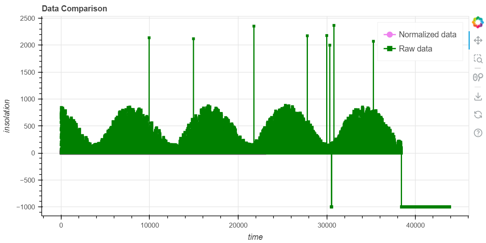
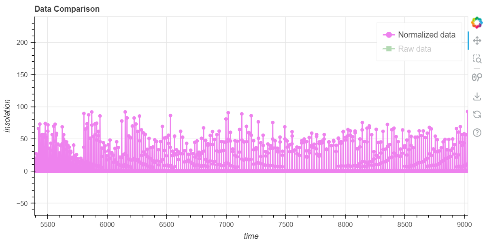
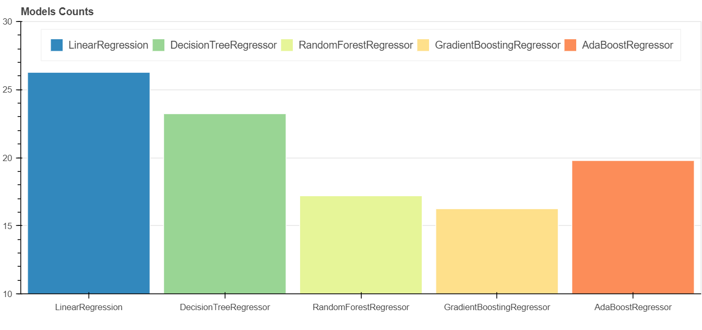
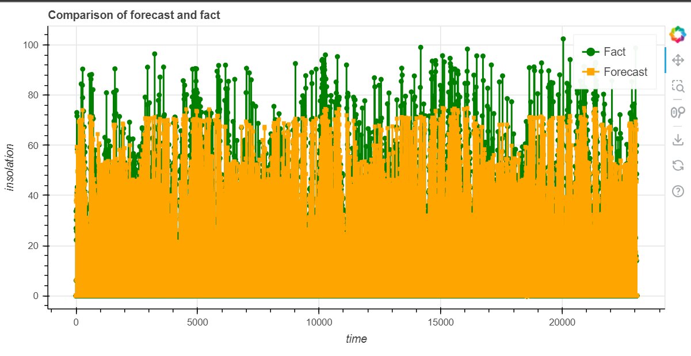
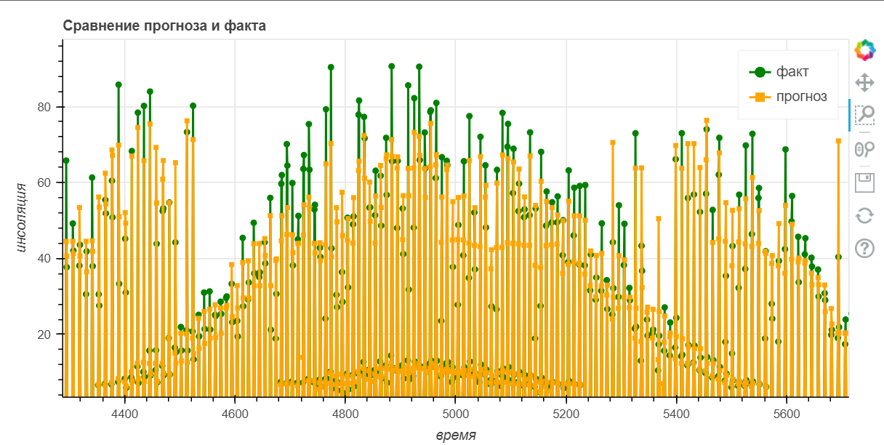
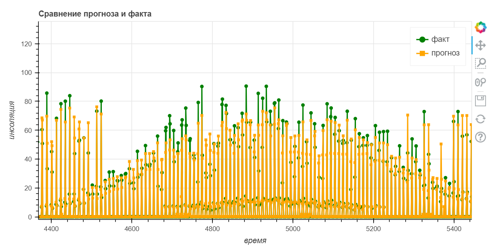

# Machine learning model for short-term insolation prediction based on meteorological data

This project was made with participation in the program at **UrFU** (Ural Federal University).

## Why is this project needed?

Day-ahead forecasting of solar power generation has several purposes. Firstly, it helps participants in the green energy market to plan their activities and optimize their costs. Secondly, it helps to balance the energy system and increase its reliability and stability. Thirdly, it allows you to adjust electricity prices depending on supply and demand. Fourth, it reduces the risk of imbalance penalties that can arise from the unpredictability of solar radiation.

## What was done?

The meteorological data of the Sverdlovsk region were used for every half hour for 5 years (2018-2023). The main goal was to clean and normalize the initial data as much as possible, since the data from different providers is different and inaccurate. After multiple manipulations, 100% of the data was corrected.

### Raw data:

### Cleared data:

As you can see, the initial data has a large number of outliers, NaN data and interferences that cannot be in nature. After the work done on cleaning and normalization, everything began to have an acceptable shape.

## About machine learning model

#### For starters, I would like to note why the machine learning model was chosen and not a neural network or something else.

An advantage in machine learning models is that they can make more accurate and interpretable predictions than neural networks. Machine learning allows you to evaluate the importance of different variables and understand how they affect the result. This can be useful for planning and optimizing the operation of the solar power plant.

Neural networks, on the other hand, can be more complex and opaque than machine learning. Neural networks require a lot of training data and can overfit or underfit if the data is not preprocessed or balanced. Neural networks are also more difficult to interpret and explain why they give a particular prediction. Neural networks can be sensitive to noise or anomalies in the data and make incorrect or inadequate predictions.

After some benchmarks, the **GradientBoostingRegressor** model was chosen.

### Benchmark results:

As you can see from this diagram, the GradientBoostingRegressor is the most accurate model.

As a result, the percentage of errors in predictions is **15-16%**, which is an excellent result when forecasting taking into account weather conditions.

### General chart:

The following two graphs will show the results in detail.

### Chart 1:

### Chart 2:

As you can see, the difference between the predicted (orange) and actually received energy is insignificant.